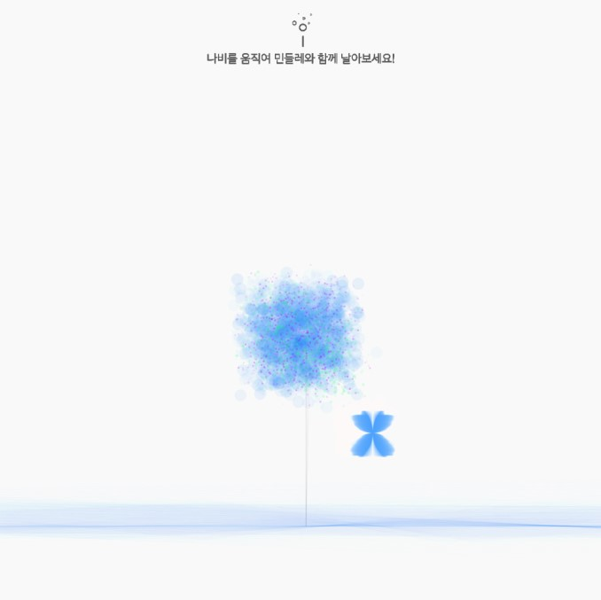
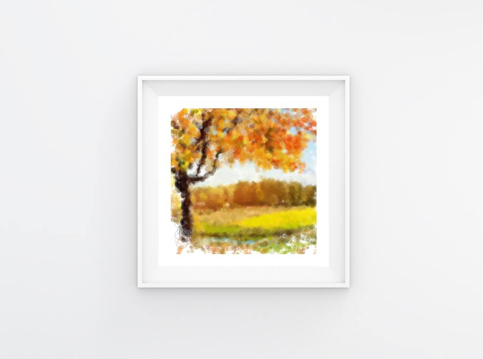

# 비주얼 프로그래밍(visual Programming)
> 홍익대학교에서 수업시간에 제작한 프로세싱 작업물입니다.

## 설치 방법

MIT에서 제공하는 프로세싱을 다운 받은 뒤 작업물을 실행합니다.  
[프로세싱 홈페이지](https://processing.org/)

## 업로드 내역

* 190412
    * 181029_Butterflies_And_Flowers upload
    * 190411_DrawYourPhoto upload

## 작품 목록

### Butterflies_And_Flowers

{: width="550"}

### DrawYourPhoto

{: width="550"}

## 정보

정진균 (jin gyun, Jeong), JJIKKYU  
jjinggu96@gmail.com  
[https://jjikkyu.com](https://jjikkyu.com)  

