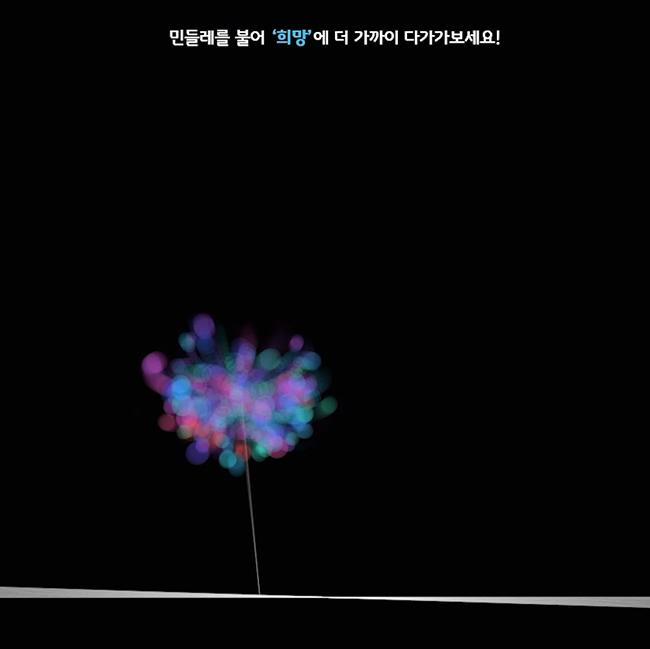

# 비주얼 프로그래밍(visual Programming)
> 홍익대학교 수업시간에 제작한 프로세싱을 이용한 비주얼프로그래밍 작업입니다.  
> This is a processing work made during class at Hongik University.  
  
## 설치 방법 (Installation Method)

프로세싱을 다운 받은 뒤 작업을 실행하면 P5.js를 제외한 프로세싱 작업은 실행됩니다.  
그 외 별도의 실행 방법이 필요할 경우 각 프로젝트에서 설명하고 있습니다.  
When you download the processing, the processing operation runs except P5.js.  
Other implementation methods are described in each project if necessary.  
[Processing](https://processing.org/)  
  
## 작품 목록 (List of works)
  
### Butterflies_And_Flowers

  
구동되는 모습은 [Youtube](https://www.youtube.com/watch?v=l9yPad29zv0)에서 확인하실 수 있습니다.  
You can see it running on [Youtube](https://www.youtube.com/watch?v=l9yPad29zv0).  

### AIproject

  
구동되는 모습은 [Youtube](https://www.youtube.com/watch?v=R6CeMo8WluY)에서 확인하실 수 있습니다.  
You can see it running on [Youtube](https://www.youtube.com/watch?v=R6CeMo8WluY).  

### DrawYourPhoto

  
구동되는 모습은 [Youtube](https://www.youtube.com/watch?v=q8hBu7vh1_g)에서 확인하실 수 있습니다.  
You can see it running on [Youtube](https://www.youtube.com/watch?v=q8hBu7vh1_g).  
  

### Hpoe : 희망
  
  
구동되는 모습은 [Youtube](https://www.youtube.com/watch?v=nQX80HPWdNE)에서 확인하실 수 있습니다.  
You can see it running on [Youtube](https://www.youtube.com/watch?v=nQX80HPWdNE).  

## 정보 (Information)

정진균 (jin gyun, Jeong), JJIKKYU  
jjinggu96@gmail.com  

