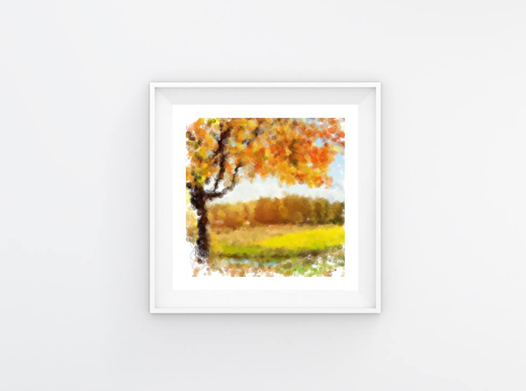

# 비주얼 프로그래밍(visual Programming)
> 홍익대학교에서 수업시간에 제작한 프로세싱 작업입니다.
> This is a processing work made during class at Hongik University.  
  
## 설치 방법

MIT에서 제공하는 프로세싱을 다운 받은 뒤 작업을 실행합니다.  
After you download the processing provided by MIT, run the task.  
[프로세싱 홈페이지](https://processing.org/)
  
## 업로드 내역

* 190412
    * Upload : Butterflies_And_Flowers
    * Upload : DrawYourPhoto
  
## 작품 목록
  
### Butterflies_And_Flowers

  
[Youtube](https://www.youtube.com/watch?v=l9yPad29zv0)  
  
### DrawYourPhoto

  
  
## 정보

정진균 (jin gyun, Jeong), JJIKKYU  
jjinggu96@gmail.com  
[https://jjikkyu.com](https://jjikkyu.com)  

